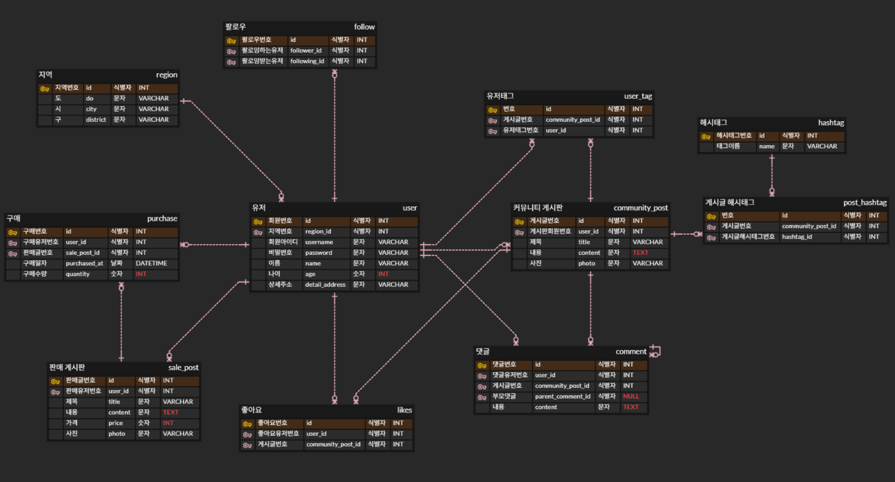

# 🛒 피로마켓 ERD (SellingCommunity)

피로그래밍 25기 과제 2 - ERD Cloud를 이용한 피로마켓 데이터베이스 ERD 설계

## 🔗 ERD Cloud 링크

https://www.erdcloud.com/d/NGsNvp7MaxovK2mu2

## 📸 ERD 캡처

## ✨ 구현 내용

### 필수 요구사항

- 유저 / 커뮤니티 게시글 / 댓글 / 판매 게시글 / 좋아요 / 구매 (엔티티 6개, 관계 8개)
- 까마귀발 표기법 (1:N 비식별 관계)
- 각 엔티티에 PK/FK, Domain, Type, NOT NULL 명시

### 추가 챌린지

- ✅ 주소 세분화 (지역 엔티티 추가, 상세주소로 변경)
- ✅ 대댓글 (댓글 자기참조)
- ✅ 팔로우 (유저 다대다, 팔로우 중간 테이블)
- ✅ 해시태그 / 유저태그 (중간 테이블로 다대다 구현)
